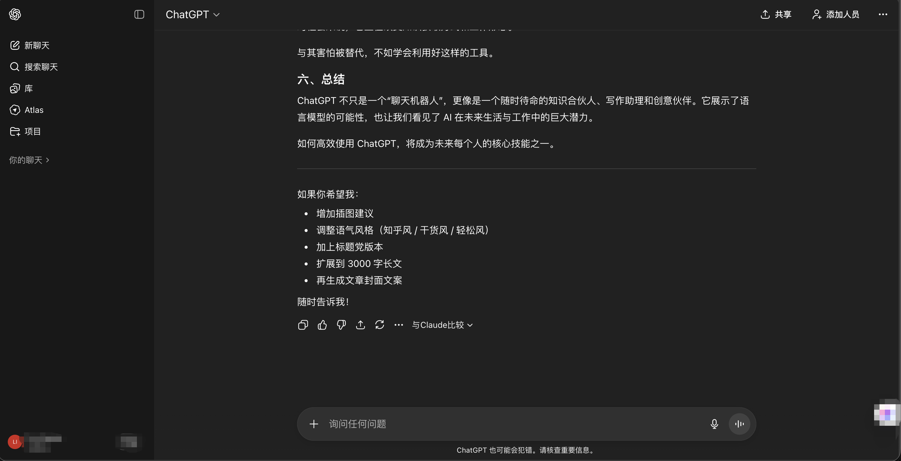

# ChatGPT官网 GPT-5.4 正式发布：Thinking、Pro 与国内使用指南

ChatGPT官网刚刚迎来 **GPT-5.4**。对于持续关注 **ChatGPT官网**、**Chat GPT官网**、**chatgpt官网地址** 和 **openai官网** 的用户来说，这次更新不是普通的小版本迭代，而是一次面向专业工作流、复杂推理、编程与智能体能力的系统升级。OpenAI 在官方页面中明确表示：GPT-5.4 是其目前“针对专业化工作负载能力最强、效率最高”的前沿模型，并且已经同步进入 ChatGPT、API 与 Codex。

::: tip 🚀 快速通道
国内用户无需翻墙，直连体验 ChatGPT 强力模型：

- **ChatGPT 中文版入口**：[点击直达 (huoyachat.com)](https://huoyachat.com)
- **稳定镜像站**：[lazymanchat.com](https://lazymanchat.com)
:::

如果你关心的问题是“GPT-5.4 到底强在哪”“ChatGPT 里能用到什么”“和 GPT-5.2 相比升级了什么”“国内用户怎么更顺手地体验 ChatGPT”，这篇文章会按官方信息给你一次讲清楚。

## 一、GPT-5.4 是什么：OpenAI 面向专业工作的最新旗舰升级

OpenAI 在 2026 年 3 月 5 日发布 GPT-5.4，并同时推出 **GPT-5.4 Pro**。根据官方描述，GPT-5.4 把近期在 **推理、编程和智能体工作流** 上的最佳能力整合到了一个统一模型中，重点服务场景不再只是“聊天”，而是更接近真实的专业交付任务，例如：

### 1. 更复杂的知识型工作

GPT-5.4 更擅长产出电子表格、演示文稿、文档、分析报告这类“可以直接拿去工作”的结果，而不是只给你一段泛泛而谈的答案。

### 2. 更可靠的长流程任务

它能在更长的任务链中保持上下文一致，减少来回补充需求的次数。对于写报告、做研究、整理材料、生成方案的人来说，这一点非常关键。

### 3. 更强的编程与智能体基础能力

OpenAI 明确提到，GPT-5.4 融合了 GPT-5.3-Codex 的领先编程能力，并且是首个具备原生顶尖“计算机使用”能力的通用模型。这意味着它不仅能写代码，还更适合在真实软件环境中调用工具、规划步骤并执行任务。

简单理解：如果之前很多模型更像“会回答问题的助手”，那么 GPT-5.4 更像“能够理解目标并推进交付的高级执行者”。

## 二、ChatGPT 中的 GPT-5.4 有哪些变化

对普通用户来说，最重要的不是 API 名字，而是 **ChatGPT 里到底有什么变化**。这次更新里，官方重点强调的是 **GPT-5.4 Thinking** 和 **GPT-5.4 Pro** 两条能力线。

### 1. GPT-5.4 Thinking：更适合复杂任务

在 ChatGPT 中，GPT-5.4 主要以 **Thinking 模式** 提供。它支持在生成前先给出一个简短的“思考计划”或“工作前言（preamble）”，让用户可以在模型执行过程中及时调整方向，而不是等到整段结果写完后再返工。

这意味着你在处理以下任务时会更舒服：

- 长篇研究与资料整合
- 多步骤写作与改稿
- 方案推演与结构设计
- 复杂问答与联网检索

### 2. 搜索能力更强，长任务更稳

官方还提到，GPT-5.4 Thinking 增强了 **深度网页搜索能力**，尤其适合那种非常具体、信息分散、需要反复检索与交叉验证的问题。同时，它在长时间思考任务中能更好保持上下文关联，让回答更连贯，也更贴近当前目标。

### 3. ChatGPT 用户如何获得

根据官方页面：

- **GPT-5.4 Thinking** 已向 **ChatGPT Plus、Team、Pro** 用户开放，并替代 GPT-5.2 Thinking。
- **GPT-5.2 Thinking** 会保留在“Legacy Models”中三个月，随后在 **2026 年 6 月 5 日**停用。
- **Enterprise** 和 **Edu** 用户可通过管理员设置开启早期访问。
- **GPT-5.4 Pro** 在 ChatGPT 中面向 **Pro 和 Enterprise** 用户提供。

值得注意的是，官方同时说明：**ChatGPT 中 GPT-5.4 Thinking 的上下文窗口与 GPT-5.2 Thinking 保持不变**。也就是说，这次 ChatGPT 侧更重要的是“质量、稳定性、任务执行方式”的升级，而不是单纯把上下文数字拉高。

> 💡 提示：推荐观看 YouTube/Vimeo 上的 GPT-5.4 Thinking 或 Computer Use 演示视频以获得直观理解。

## 三、GPT-5.4 为什么值得关注：官方基准数据有哪些提升

如果只看宣传语，很容易觉得“又是一次常规升级”。但 OpenAI 这次给出了不少具体数据，能帮助我们判断 GPT-5.4 的真实定位。

### 1. 知识型工作能力更强

在 **GDPval** 这一衡量模型完成明确知识工作的基准测试中，GPT-5.4 达到 **83.0%** 的“胜出或持平”成绩，而 GPT-5.2 为 **70.9%**。这说明它在法律、金融、运营、咨询、文档处理这类专业工作里，更接近真正可交付的水平。

在 OpenAI 内部的投资银行建模任务中，GPT-5.4 得分 **87.3%**，相比 GPT-5.2 的 **68.4%** 有明显提升。官方还特别提到，它在创建和编辑电子表格、演示文稿与文档方面表现更好。

### 2. 错误率进一步下降

OpenAI 表示，GPT-5.4 是其“迄今准确率最高的模型”。在一组用户曾标记存在事实错误的去标识化提示测试中：

- 与 GPT-5.2 相比，**单项陈述错误率降低 33%**
- **完整回复包含错误的概率降低 18%**

这对于常把 ChatGPT 用在总结资料、生成商务文档、解释专业问题的用户来说，价值比“会不会更会聊天”更大。

### 3. 编程与网页搜索也同步增强

官方页面给出的部分关键数据包括：

- **SWE-Bench Pro（Public）**：GPT-5.4 为 **57.7%**，高于 GPT-5.2 的 **55.6%**
- **BrowseComp**：GPT-5.4 为 **82.7%**，GPT-5.4 Pro 达到 **89.3%**
- **Toolathlon**：GPT-5.4 为 **54.6%**，高于 GPT-5.2 的 **45.7%**

这些指标共同说明：GPT-5.4 并不是只在某一个点上增强，而是在“推理 + 搜索 + 工具调用 + 编码”四个方向一起抬高了下限和上限。

## 四、开发者最该看的部分：计算机使用、工具搜索与 API 定价

虽然很多人是通过 ChatGPT 使用 GPT-5.4，但真正让这一代模型拉开差距的，是它在开发者生态中的能力升级。

### 1. 原生计算机使用能力

官方称 GPT-5.4 是 OpenAI 首个具备 **原生顶尖计算机使用能力** 的通用模型。它既能通过 Playwright 这类库写代码操作电脑，也能依据截图直接执行鼠标和键盘动作。

在 **OSWorld-Verified** 测试中，GPT-5.4 达到 **75.0%**，不仅远高于 GPT-5.2 的 **47.3%**，也超过了官方给出的人类基准 **72.4%**。这意味着它在跨网页和软件系统执行任务时，已经非常接近可落地的智能体能力。

### 2. 工具搜索（Tool Search）

GPT-5.4 在 API 中引入了 **工具搜索**。过去要让模型调用工具，往往需要提前把大量工具定义全部塞进上下文，既贵又慢。现在模型可以先拿到精简工具列表，需要时再查找具体定义。

OpenAI 在 **MCP Atlas** 公开任务上的测试显示：在保持相同准确率的前提下，启用工具搜索后，总 Token 使用量降低了 **47%**。对于工具很多、工作流很长、调用 MCP 服务器较多的团队，这种优化会直接影响成本和延迟。

### 3. Codex 与 API 中的额外亮点

官方还给出几条很值得注意的信息：

- API 模型名已上线：`gpt-5.4` 与 `gpt-5.4-pro`
- GPT-5.4 是首个融合 GPT-5.3-Codex 编程能力的常规推理模型
- Codex 中提供 **1M 上下文窗口实验支持**
- 超过标准 **272K** 上下文窗口的请求，会按正常费率 **2 倍**计入用量限制
- Batch 和 Flex 价格为标准 API 费率的一半，Priority 处理为标准费率两倍

### 4. API 官方价格一览

| API 模型 | 输入价格 | 缓存输入价格 | 输出价格 |
| --- | --- | --- | --- |
| gpt-5.2 | $1.75 / 百万 token | $0.175 / 百万 token | $14 / 百万 token |
| gpt-5.4 | $2.50 / 百万 token | $0.25 / 百万 token | $15 / 百万 token |
| gpt-5.2-pro | $21 / 百万 token | - | $168 / 百万 token |
| gpt-5.4-pro | $30 / 百万 token | - | $180 / 百万 token |

表面上看，GPT-5.4 比 GPT-5.2 单价更高；但 OpenAI 同时强调，GPT-5.4 的 **Token 效率更高**，解决同类问题往往消耗更少 Token，因此实际总成本未必按单价比例上升。

## 五、国内用户如何看待 GPT-5.4：官网、镜像站与实际使用建议

如果你在国内使用 ChatGPT，最现实的问题通常不是“模型强不强”，而是“怎么稳定用、怎么高效用”。

### 1. 官网路线：适合需要最新能力的人

如果你追求最完整的 GPT-5.4 能力，尤其是 ChatGPT 里的 Thinking 模式、Pro 模式、官方搜索体验或开发者生态，那么建议优先使用官网：

- **ChatGPT 官网入口**：<https://chatgpt.com>
- **OpenAI 官网**：<https://openai.com>

对于一些仍在搜索旧地址的用户，可以知道：过去常见的 `chat.openai.com` 入口如今通常会跳转到新的 ChatGPT 域名体系。

### 2. 国内直连路线：适合先体验 ChatGPT 中文能力

如果你主要需求是中文问答、写作、内容整理、学习辅导、办公提效，而当前又受限于注册、网络或支付问题，那么先使用稳定的中文入口通常更省时间：

- **ChatGPT 中文版入口**：[huoyachat.com](https://huoyachat.com)
- **稳定镜像站**：[lazymanchat.com](https://lazymanchat.com)

当你遇到 **账号注册困难**、**网络延迟** 或 **支付不便** 时，也可以自然过渡到更易上手的替代方案，例如：[GPT 极速体验站 (gemini-cnblog.com)](https://gemini-cnblog.com)。实际支持的模型线路、功能范围和套餐说明，请以对应平台页面为准。

### 3. 谁最适合升级到 GPT-5.4

如果你属于下面几类用户，GPT-5.4 的价值会更明显：

- 经常写报告、做分析、整理材料的咨询/运营/市场人员
- 需要高可靠代码辅助的开发者与产品经理
- 频繁处理表格、演示文稿和文档的办公用户
- 依赖联网搜索、事实核查和复杂资料整合的研究者
- 希望把 ChatGPT 当作长期工作助手的重度用户

换句话说，GPT-5.4 更像是“把 ChatGPT 从对话工具升级为专业生产力平台”的一次更新。

## 六、常见问题 FAQ：关于 GPT-5.4，你最关心的几个问题

### GPT-5.4 在 ChatGPT 里最重要的变化是什么？

最关键的是 **GPT-5.4 Thinking**。它让 ChatGPT 在复杂任务里更会规划、更会搜索、更能保持长流程一致性，并且支持用户在生成过程中调整方向。

### GPT-5.4 Pro 和 GPT-5.4 Thinking 有什么区别？

根据官方页面，**GPT-5.4 Pro** 面向“极复杂任务中追求极致性能”的用户；而 **GPT-5.4 Thinking** 是大多数 ChatGPT 付费用户会直接接触到的主力版本。

### GPT-5.4 的上下文是不是 1M？

要区分平台。官方明确写的是：**Codex 中提供 1M 上下文窗口的实验支持**；而 **ChatGPT 中 GPT-5.4 Thinking 的上下文窗口与 GPT-5.2 Thinking 保持不变**。

### GPT-5.4 更适合普通聊天还是专业工作？

从 OpenAI 的整篇发布稿来看，GPT-5.4 的定位明显更偏向 **专业工作、复杂推理、工具调用和智能体执行**。如果你只是做轻量聊天，感受会有提升；如果你拿它处理研究、文档、表格、代码和流程任务，提升会更明显。

### 国内用户是否一定要走官网？

不一定。如果你最在意的是官方最新功能、原生模型选择和开发者生态，就优先用官网；如果你更在意便捷、中文体验和访问稳定性，可以先从中文版入口开始。

## 七、总结：GPT-5.4 让 ChatGPT 更像真正的工作伙伴

从 OpenAI 官方页面来看，GPT-5.4 的重点并不是单一指标的“刷新纪录”，而是把 **知识型工作、编程、计算机使用、工具搜索和长流程稳定性** 统一到了一个更成熟的模型体系里。对 ChatGPT 用户而言，它带来的是更好的 Thinking 体验、更强的深度搜索、更稳定的复杂任务执行；对开发者而言，它则意味着更强的智能体基座和更好的 Token 效率。

如果你现在正在关注 **ChatGPT官网**、**chatgpt官网地址**、**openai官网** 或 **ChatGPT中文版** 的最新动态，那么 GPT-5.4 是一次非常值得跟进的升级。

::: tip 📌 结尾建议
如果你想先用更低门槛的方式体验中文场景下的 ChatGPT 能力，可以继续参考：**ChatGPT 专业中文站** [ai.lanjingchat.com](https://ai.lanjingchat.com)。
:::

你也可以把 OpenAI 官方原文加入收藏：<https://openai.com/zh-Hans-CN/index/introducing-gpt-5-4/> 。后续如果 OpenAI 继续调整 ChatGPT 侧的模型开放范围，这篇文章也建议同步更新。
